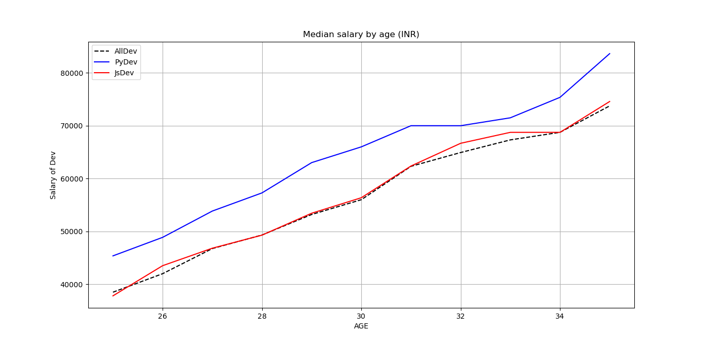
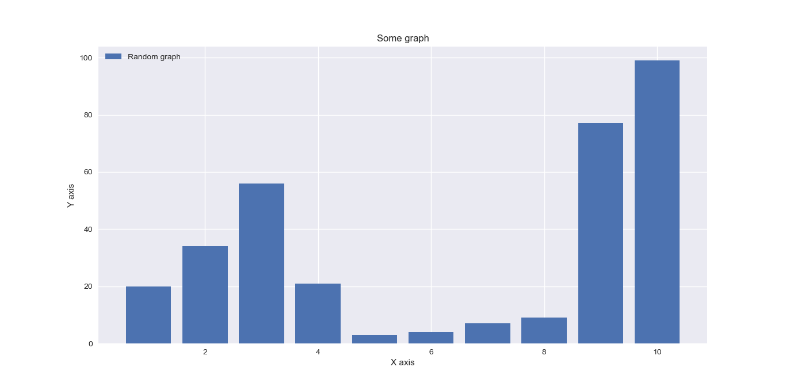
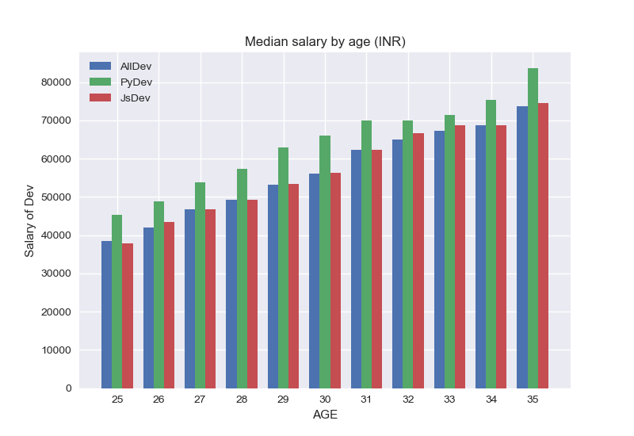
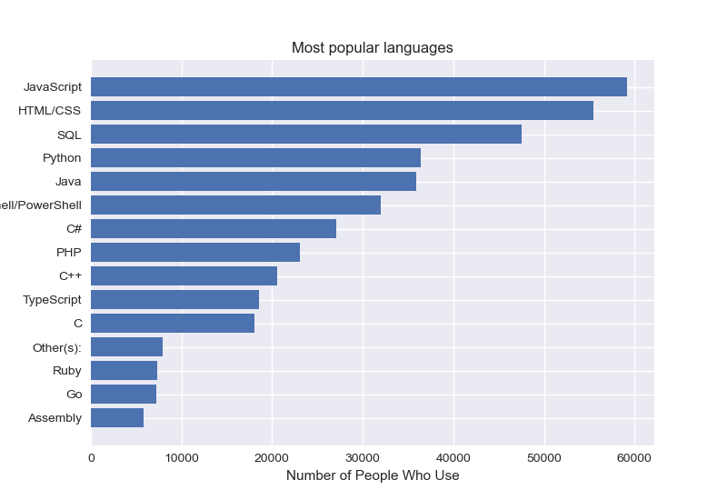
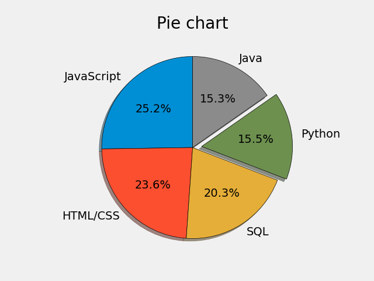

# Some Matplotlib Plots

  ## 1. Dev Salary VS their Age
  

   
  

  
 ## 3. Barchart
 

  

## 3. Dev Salary VS their Age

  

  
 ## 4. Programming languages VS their popularity
  

    
  

  
## 5. Pie Chart of Popularity of Programming languages

    
  

  
 ## 6. Stack plots
 
