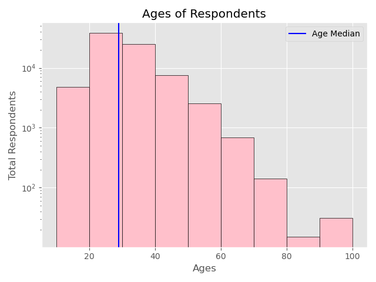

# Some Matplotlib Plots
  ## 1. Dev Salary VS their Age
  

   
  

  
 ## 2. Barchart
 

  

## 3. Dev Salary VS their Age

  

  
 ## 4. Programming languages VS their popularity
  

    
  

  
## 5. Pie Chart of Popularity of Programming languages

    
  

  
 ## 6. Stack plots (Dev working hours)
 

    
  

 
  ## 7. Fill the Area under Line
  

    
  

  
  ## 8. Histogram
  

    
  

  
  ## 9. Scatter Plot
  

    
  

  
